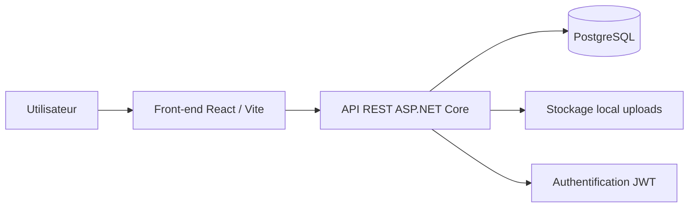

# Documentation technique DataShare

## 1. Objectif du projet

DataShare est un prototype de plateforme de transfert sécurisé de fichiers. L'objectif du MVP est de permettre à un utilisateur inscrit de déposer un fichier, de générer un lien temporaire de téléchargement, de consulter son historique et de supprimer les fichiers qu'il a envoyés.

Le prototype couvre les fonctionnalités principales demandées : création de compte, connexion, upload avec compte, lien de téléchargement, historique utilisateur et suppression.

## 2. Architecture de l'application



### Description des briques

| Brique | Rôle |
|---|---|
| React / Vite | Interface utilisateur, formulaires, appels API, parcours de téléchargement |
| ASP.NET Core Web API | Exposition des endpoints REST, authentification, règles métier |
| Entity Framework Core | Accès aux données et migrations PostgreSQL |
| PostgreSQL | Stockage des utilisateurs et métadonnées de fichiers |
| Stockage local | Conservation physique des fichiers uploadés |
| JWT | Sécurisation des routes privées |

## 3. Choix technologiques justifiés

### Front-end : React / Vite

React est adapté au besoin car l'application contient plusieurs écrans indépendants : inscription, connexion, upload, historique et téléchargement public. Vite facilite le lancement local et la génération du build.

### Back-end : ASP.NET Core Web API

ASP.NET Core permet de structurer l'API en controllers, services, DTO et modèles. Le framework gère correctement l'authentification JWT, les middlewares, la configuration et les tests d'intégration via WebApplicationFactory.

### Base de données : PostgreSQL

PostgreSQL est utilisé pour stocker les utilisateurs et les métadonnées. C'est une base relationnelle robuste et bien supportée par Entity Framework Core.

### Stockage : système de fichiers local

Le stockage local est retenu pour le MVP afin de limiter la complexité. En production, un stockage objet comme S3 serait plus adapté pour la scalabilité, les quotas, la réplication et la sauvegarde.

## 4. Modèle de données

```mermaid
erDiagram
    USERS ||--o{ STORED_FILES : owns
    USERS {
        uuid Id PK
        text Email UK
        text PasswordHash
        datetime CreatedAt
    }
    STORED_FILES {
        uuid Id PK
        text OriginalName
        text StoredName
        text ContentType
        bigint Size
        text RelativePath
        text Token UK
        text PasswordHash nullable
        datetime UploadedAt
        datetime ExpiresAt
        uuid UserId FK
    }
```

### Table Users

| Champ | Type | Description |
|---|---|---|
| Id | uuid | Identifiant unique de l'utilisateur |
| Email | text | Email unique utilisé pour la connexion |
| PasswordHash | text | Mot de passe hashé avec BCrypt |
| CreatedAt | timestamp | Date de création du compte |

### Table StoredFiles

| Champ | Type | Description |
|---|---|---|
| Id | uuid | Identifiant interne du fichier |
| OriginalName | text | Nom original fourni par l'utilisateur |
| StoredName | text | Nom réel du fichier sur disque |
| ContentType | text | Type MIME |
| Size | bigint | Taille du fichier en octets |
| RelativePath | text | Chemin relatif du fichier stocké |
| Token | text | Token public non prédictible du lien |
| PasswordHash | text nullable | Mot de passe de fichier hashé si renseigné |
| UploadedAt | timestamp | Date d'envoi |
| ExpiresAt | timestamp | Date d'expiration |
| UserId | uuid | Propriétaire du fichier |

## 5. Documentation d'API

### GET /api/health

Vérifie l'état de l'API.

Réponse 200 :

```json
{
  "status": "OK",
  "app": "DataShare API"
}
```

### POST /api/auth/register

Crée un compte utilisateur.

Body :

```json
{
  "email": "user@example.com",
  "password": "Password123!"
}
```

Réponse 200 :

```json
{
  "token": "jwt",
  "email": "user@example.com"
}
```

Erreurs :

| Code | Cas |
|---|---|
| 400 | Email déjà utilisé ou payload invalide |

### POST /api/auth/login

Connecte un utilisateur existant.

Body :

```json
{
  "email": "user@example.com",
  "password": "Password123!"
}
```

Réponse 200 : token JWT et email.

Erreurs :

| Code | Cas |
|---|---|
| 401 | Identifiants incorrects |

### POST /api/files/upload

Téléverse un fichier. Route protégée par JWT.

Type : `multipart/form-data`

| Champ | Type | Obligatoire | Description |
|---|---|---|---|
| file | file | Oui | Fichier à téléverser |
| expirationDays | number | Non | Durée entre 1 et 7 jours |
| password | string | Non | Mot de passe optionnel du fichier |

Réponse 200 :

```json
{
  "id": "uuid",
  "originalName": "document.txt",
  "size": 1234,
  "expiresAt": "2026-07-26T10:00:00Z",
  "downloadUrl": "http://localhost:5173/download/token"
}
```

### GET /api/files/me

Retourne les fichiers de l'utilisateur connecté.

Réponse 200 : liste des fichiers avec statut d'expiration et lien de téléchargement.

### DELETE /api/files/{id}

Supprime un fichier appartenant à l'utilisateur connecté.

Réponse :

| Code | Cas |
|---|---|
| 204 | Suppression réussie |
| 404 | Fichier introuvable ou non propriétaire |

### GET /api/download/{token}

Retourne les métadonnées publiques d'un fichier.

Réponse 200 :

```json
{
  "originalName": "document.txt",
  "size": 1234,
  "expiresAt": "2026-07-26T10:00:00Z",
  "isExpired": false,
  "requiresPassword": false
}
```

### POST /api/download/{token}

Télécharge réellement le fichier.

Body :

```json
{
  "password": "optionnel"
}
```

Réponse 200 : contenu binaire du fichier.

### GET /api/download/{token}/file

Téléchargement direct pour un fichier non protégé par mot de passe.

## 6. Sécurité et gestion des accès

- Les mots de passe utilisateurs sont hashés avec BCrypt.
- Les mots de passe de fichiers sont également hashés.
- Les routes d'upload, d'historique et de suppression nécessitent un JWT.
- L'identifiant utilisateur est lu depuis les claims du JWT.
- La suppression vérifie que le fichier appartient à l'utilisateur connecté.
- Les tokens de téléchargement sont générés avec des octets aléatoires cryptographiques.
- Les extensions dangereuses les plus évidentes sont bloquées côté serveur.
- Les fichiers expirés ne sont plus téléchargeables.

## 7. Qualité, tests et maintenance

### Tests automatisés

Le projet contient des tests d'intégration back-end couvrant :

- état de l'API ;
- création de compte ;
- email déjà utilisé ;
- connexion ;
- erreur de connexion ;
- upload authentifié ;
- upload sans authentification ;
- métadonnées de téléchargement ;
- téléchargement avec et sans mot de passe ;
- historique utilisateur ;
- suppression propriétaire ;
- refus de suppression par un autre utilisateur.

Les tests utilisent SQLite en mémoire pour éviter de dépendre d'une base PostgreSQL réelle pendant l'exécution de la suite de tests.

### Tests E2E

Cypress teste un parcours navigateur : création de compte, upload, consultation du lien et téléchargement.

### Couverture

La couverture est générée avec coverlet et exportée au format Cobertura. Le rapport HTML est produit avec ReportGenerator.

## 8. Performance

Le point critique est l'upload et le téléchargement de fichier. Le projet fournit un script k6 pour tester le parcours API principal. Le budget front recommande de surveiller le build Vite, le poids des assets et le temps de chargement local.

## 9. Installation et exécution

### Base de données

```powershell
docker compose up -d postgres
```

### Migrations

```powershell
cd backend\DataShare.Api
dotnet ef database update
```

### API

```powershell
dotnet run
```

### Front

```powershell
cd frontend
npm install
npm run dev
```

## 10. Utilisation de l'IA

L'IA a été utilisée uniquement sur US02, le téléchargement via lien. Elle a servi à proposer une structure de page publique, à distinguer les métadonnées du téléchargement réel, et à corriger le lien généré après upload. Le code a été relu, adapté et validé manuellement avant intégration.

Le détail complet est disponible dans `docs/AI_USAGE.md`.

## 11. Limites connues et évolutions

- La purge automatique des fichiers expirés n'est pas encore planifiée par cron.
- Le stockage local doit être remplacé par S3 ou équivalent pour une vraie production.
- Un antivirus devrait analyser les fichiers uploadés.
- Un rate limiting devrait être ajouté sur login et upload.
- Les logs structurés pourraient être enrichis avec Serilog ou OpenTelemetry.
